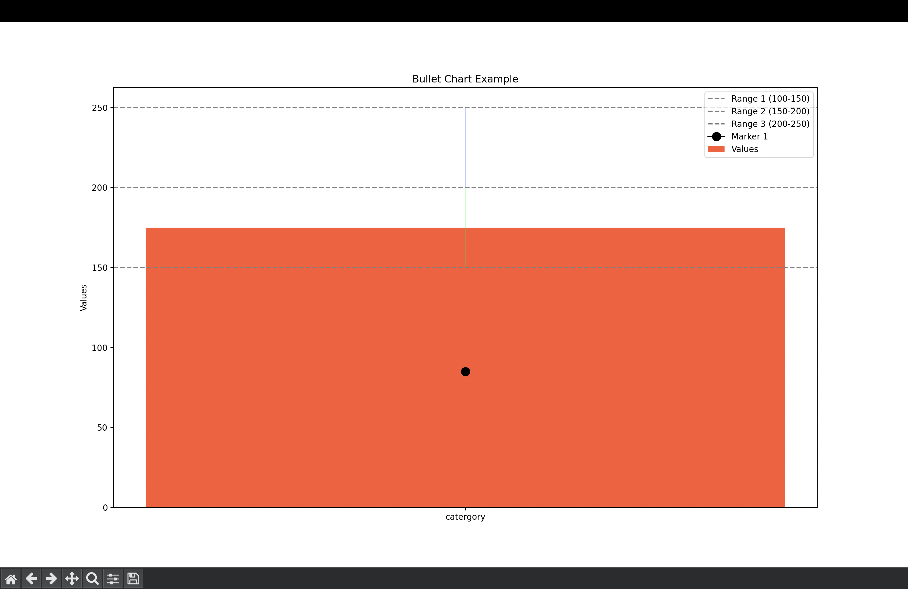

# 🐍 Python Learning Journey

Welcome to my **Python Learning Repository**! This project is a collection of code snippets, exercises, and small projects that document my journey in learning Python — from the basics to more advanced concepts.

---

## 📚 What You'll Find Here

This repo is organized into folders that represent different areas of Python learning:

| Folder           | Description |
|------------------|-------------|
| `Basics/`         | Variables, data types, input/output, and basic operators. |
| `Conditions/`     | If-else statements, logical operators, nested conditions. |
| `Loops/`          | For loops, while loops, break/continue. |
| `Functions/`      | Function definitions, arguments, return values, scope. |
| `Collections/`    | Lists, tuples, dictionaries, sets, and their methods. |
| `OOP/`            | Classes, objects, inheritance, encapsulation. |
| `FileIO/`         | Reading from and writing to files. |
| `ErrorHandling/`  | Try/except blocks, custom exceptions. |
| `Projects/`       | Mini projects and applied practice. |
| `Visualizations/` | Bullet charts, hexabin plots, and other data visuals. |

---

## 🎯 Learning Goals

- Understand Python syntax and semantics.
- Practice writing clean and efficient code.
- Develop problem-solving and algorithmic thinking.
- Explore Object-Oriented Programming (OOP).
- Prepare for real-world Python development.
- Visualize data using `matplotlib` and `numpy`.

---

## 🛠️ Requirements

- Python 3.9 or higher
- Recommended: Virtual Environment

```bash
python3 -m venv .venv
source .venv/bin/activate  # On Windows use: .venv\Scripts\activate

```
---

## 📊 Visualizations & Plots

As part of my Python learning, I've started exploring **data visualization** using `matplotlib` and `numpy`. Some of the charts I’ve created so far:

### 1️⃣ Bullet Chart


---
### 1️⃣ Line Chart


### 2️⃣ Hexbin Plot

A hexbin density plot created with random data:

```python
import matplotlib.pyplot as plt
import numpy as np

x = np.random.rand(10000)
y = np.random.rand(10000)

plt.hexbin(x, y, gridsize=50, cmap='Blues', mincnt=1)
plt.colorbar(label='Counts')
plt.title('Hexabin Plot')
plt.xlabel('X-axis')
plt.ylabel('Y-axis')
plt.grid(True)
plt.show()